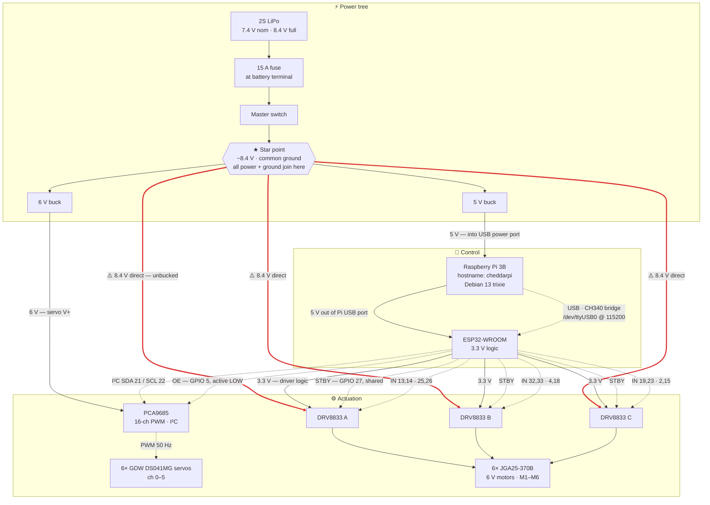

# Cheddar — Hardware Reference

**Single source of truth for the rover's physical build.** Other docs link here rather than
restating it. The only thing that outranks this file is [`MotionDriver/include/pins.h`](MotionDriver/include/pins.h),
which is authoritative for pin numbers — if this file and `pins.h` disagree, `pins.h` wins and this file is a bug.

Last verified against hardware: 2026-07-16.

## Bill of materials

| Component | Part | Role |
| --- | --- | --- |
| Compute | Raspberry Pi 3 Model B | High-level control, camera, WebRTC UI (ChedWeb) |
| MCU | Freenove ESP32-WROOM breakout (FNK0091) | Low-level motion firmware (MotionDriver) |
| Servo PWM | PCA9685, 16-channel, I²C | Drives 6 steering servos |
| Motor drivers | 3× DRV8833 dual H-bridge | Drives 6 DC motors |
| Motors | 6× **JGA25-370B** 25 mm gear-reducer DC motor, **6 V** (encoder fitted but unused) | Drive |
| Servos | 6× **GDW DS041MG** metal-gear micro digital servo, 5 kg·cm, 180° | Steering |
| Battery | 2S LiPo — 7.4 V nominal, 8.4 V full | Single source for the whole rover |
| Camera | Pi camera module (picamera2 / H.264) | Video streaming |

**Not in the build:** Arduino Mega and ESP32-C3 SuperMini were both evaluated and dropped.
`MotorDriver/` and `ServoMotorDriver/` are historical Arduino sketches, retained for reference only.

### Actuator detail

**Motors — JGA25-370B, 6 V variant.** 25 mm gearbox on a 370-size can. Sold in 6 V / 12 V / 24 V
variants; **ours are the 6 V**. That matters — see the overvolt warning below.

The motors ship with a Hall-effect quadrature encoder, but it is **not used**. Only the two
motor-drive wires are connected, straight to a DRV8833 output pair; the encoder leads are left
unconnected. The rover is deliberately open-loop.

**Servos — GDW DS041MG.** Metal-gear micro digital servo, ~5 kg·cm, 180° rotation, marketed for
450-class helicopters and small robot arms. Digital servos draw noticeably more current than
analogue ones at hold and under load, which is relevant to the brownout issue below. ⚠️ Rated
voltage not yet confirmed — micro servos in this class are typically 4.8–6.0 V, and a full 2S pack
is 8.4 V.

## Wiring

Solid edges carry power; dashed edges carry signal.

### Pi ↔ ESP32 is USB, not GPIO UART

The Pi talks to the ESP32 over a **USB cable** into the breakout's CH340 UART bridge, enumerating
as `/dev/ttyUSB0` (VID `1a86`) at 115200 baud. The firmware binds its command parser to `Serial`
(UART0) — see [`main.cpp:17`](MotionDriver/src/main.cpp#L17).

This must be a **data** USB cable. A charge-only cable, or the breakout's *native USB* port, will
power the board but never enumerate — both failure modes cost real debugging time during bring-up.

> `PIN_UART2_RX` (16) and `PIN_UART2_TX` (17) still exist in `pins.h` but **nothing opens them**.
> They are vestigial from an earlier GPIO-UART plan. Don't wire to them expecting them to work.

## ESP32 pin map

Authoritative source: [`MotionDriver/include/pins.h`](MotionDriver/include/pins.h).

| Function | GPIO | Notes |
| --- | --- | --- |
| I²C SDA (PCA9685) | 21 | |
| I²C SCL (PCA9685) | 22 | |
| DRV8833 STBY | 27 | Shared across all three drivers; LOW disables all outputs |
| PCA9685 OE | 5 | Active-LOW output enable |
| M1 IN1 / IN2 | 13, 14 | Driver A |
| M2 IN1 / IN2 | 25, 26 | Driver A |
| M3 IN1 / IN2 | 32, 33 | Driver B |
| M4 IN1 / IN2 | 4, 18 | Driver B |
| M5 IN1 / IN2 | 19, 23 | Driver C |
| M6 IN1 / IN2 | 2, 15 | Driver C — **boot-strapping pins**, must not be held LOW at power-up |

Avoid GPIO 34–39 for outputs — they are input-only on the WROOM.

## Wheel indexing

Motors and servos share one index. **The index does *not* map to `M(n+1)`** — the loom was not
wired in wheel order. `M1`–`M3` carry the **right** side front→rear and `M4`–`M6` the **left** side
front→rear, so `MOTOR 0` (Front Left) drives M4 on GPIO 4/18.

**Five of the six** motors are also wired with their leads **reversed** relative to the DRV8833
forward contract below, so the firmware swaps IN1/IN2 for those to keep `FORWARD` driving the rover
forward. **Middle Left is the exception** — it is wired the normal way round.

Both facts are absorbed in the wheel→pin table in
[`MotorController.cpp`](MotionDriver/src/outputs/MotorController.cpp) — `pins.h` still records the
raw GPIO→driver-channel wiring, which is unchanged. Verified against hardware 2026-07-16 by driving
all six wheels in **both** directions and observing which wheel turned and which way.

> **Test both directions after any harness work.** Before 2026-07-16 the firmware drove IN1 for
> `FORWARD` on every motor, so the whole IN2 side (pins 18, 14, 23, 26, 15, 33) went unexercised and
> a loose GPIO 14 → DRV8833 A IN2 lead sat undetected — Front Right drove backward fine and simply
> did nothing forward. That wire has been fixed, but a forward/backward asymmetry on a single wheel
> is the signature of exactly this, so suspect the IN-side lead before the firmware.

**The servo loom is mis-ordered too, and differently.** Wheel index does not equal PCA9685 channel:
the left side sits on channels 0–2 running rear→front, and the right side does *not* mirror it.
There is no formula — it is a lookup, held in `kWheelToPcaChannel` in
[`ServoController.cpp`](MotionDriver/src/outputs/ServoController.cpp). The translation happens in
`writeMicroseconds`, the single point where a wheel index becomes a physical channel; everything
else in that class stays wheel-indexed.

| Index | Position | Motor | Driver | IN1 / IN2 (fwd, rev) | PCA9685 ch |
| --- | --- | --- | --- | --- | --- |
| 0 | Front Left | M4 | B | 18, 4 | 2 |
| 1 | Front Right | M1 | A | 14, 13 | 4 |
| 2 | Middle Left | M5 | C | 19, 23 | 1 |
| 3 | Middle Right | M2 | A | 26, 25 | 3 |
| 4 | Rear Left | M6 | C | 15, 2 | 0 |
| 5 | Rear Right | M3 | B | 33, 32 | 5 |

Both looms were verified against hardware on 2026-07-16 by driving each index and observing which
wheel responded. **Neither the motor nor the servo loom follows wheel order, and they are mis-ordered
in *different* ways** — never infer one from the other, and never assume index `n` is channel `n`.

### Units — the two layers disagree, on purpose

`ControlCommand` (browser → backend) and the UART CLI (backend → ESP32) do **not** use the same
units. The [ChedWeb bridge](PieBrain/ChedWeb/backend/motion_driver_bridge.py) is what converts
between them.

| | `ControlCommand` | UART CLI |
| --- | --- | --- |
| Motor speed | `-1.0` … `1.0`, sign = direction | `MOTOR <n> FORWARD\|BACKWARD <0.0-1.0>` — direction is a word, speed is unsigned |
| Servo position | `0`–`180°`, `90` = straight | `S <ch> <us>` — **microseconds**, clamped 1000–2000, `1500` = straight |

> ⚠️ Servo values are **degrees at the top and microseconds at the bottom**. Passing degrees
> straight through is silently destructive: every angle in 0–180 falls under the firmware's 1000 µs
> floor, so all six servos clamp hard over and steering appears dead — 45° and 135° clamp to the
> same value. This shipped once; `tests/test_motion_driver_bridge.py` now pins the conversion.

## Motor control contract

| State | IN1 | IN2 |
| --- | --- | --- |
| Forward | PWM | LOW |
| Reverse | LOW | PWM |
| Coast | LOW | LOW |
| Brake | HIGH | HIGH |

`STBY` LOW disables all outputs; raise it only after init completes. PWM is generated by the
ESP32's LEDC peripheral at 10–15 kHz for motors (above audible range); servo PWM is 50 Hz and
handled by the PCA9685.

## Power tree

Everything comes off one 2S LiPo, through a **15 A fuse at the battery terminal**, then the master
switch, then a **star point** where all power and ground join. Nothing daisy-chains — every branch
returns to the star.

| Branch | Voltage | Feeds |
| --- | --- | --- |
| 6 V buck | 6 V | PCA9685 servo rail → 6× DS041MG |
| 5 V buck | 5 V | Raspberry Pi, via its USB power port |
| **direct** | **8.4 V** | **3× DRV8833 motor supply → 6× motors — see below** |

**All logic is daisy-chained off the Pi.** The 5 V buck feeds the Pi; the Pi's USB port feeds the
ESP32; the ESP32's 3.3 V regulator feeds the DRV8833 logic supplies. So the logic chain is a single
series path, not a star branch:

`5 V buck → Pi → USB → ESP32 → 3.3 V → DRV8833 logic`

Current draw along that chain is small (the DRV8833 logic supplies are milliamps), so this is fine
under normal load. It matters for the failure mode described below.

Other rules in force:

- **Star ground.** One common ground for ESP32, drivers, PCA9685, Pi, and battery at a single point.
  Separate returns for motors, servos, and logic run back to that star.
- **Bulk capacitance.** 470–1000 µF electrolytic near each DRV8833 and the PCA9685.
- **Routing.** Keep motor leads short and twisted, away from the I²C and USB lines.

### 🔴 Voltage mismatch — 6 V motors on an unbucked 8.4 V rail

**The servos are bucked to 6 V and the Pi to 5 V, but the motor rail is not bucked at all.** The
DRV8833s sit directly on the pack, so 6 V motors see up to **8.4 V — 40% over their rating**.

This is not an instant failure — it's a heat and lifespan problem. Overvolted brushed motors run
hot, wear brushes faster, and push more current through the gearbox than it was rated for, which is
how 25 mm gear trains strip teeth. It also makes the brownout below worse: higher voltage means
higher inrush, and inrush is what sags the rail.

Note the asymmetry — the servos already have their 6 V buck, so this is a *motor-rail-only*
problem. That makes it a cheaper fix than it first looks: the buck only needs to carry the motors,
not the servos too.

Two ways out:

1. **Add a buck on the motor rail at ~6.0–6.5 V.** The correct fix. Size it for the stall current of
   six geared motors — the servos are already handled elsewhere.
2. **Cap PWM duty in firmware** to ~70% (6.0/8.4) so the *average* lands near 6 V. Free and
   reversible, but it is only an average: the motors still see full 8.4 V peaks every PWM cycle, and
   it silently costs top speed. A stopgap, not a fix.

Until one is in place, treat sustained full-throttle running as something that shortens motor life.

### ⚠️ Known issue — brownouts

Running motors has frozen the entire Pi, camera included. Diagnose with `vcgencmd get_throttled`
(`0x0` = clean, bit 0 = now, bit 16 = has occurred).

The Pi already has its own 5 V buck, so this is **not** a case of the Pi sharing a regulator with
the motors. But both bucks still hang off the same star point, and a buck can only regulate what
it's given — when motor inrush drags the pack voltage down far enough, the 5 V buck loses headroom
and its output dips with it. The isolation is downstream of the problem.

That means the fix has to be upstream of the star, or independent of it:

- **Bulk capacitance at the star point** — the cheapest thing to try, and it directly targets the
  transient rather than the average.
- **Separate battery for the Pi** — true isolation. Ugly, but decisively removes the coupling.
- **Reduce the inrush itself** — the motor overvolt above is making this worse than it needs to be;
  bucking the motor rail to 6 V would shrink the current spike as a side effect.

Adding current sensing (below) would tell you which of these is actually warranted, rather than
guessing.

### 🔴 Brownout runaway risk — worth checking

The logic chain and the motor supply fail **independently**, and that asymmetry is dangerous.

The DRV8833s take their motor supply straight off the star at 8.4 V, but their logic — and the
ESP32 driving them — come down the chain from the Pi. During a brownout the logic chain sags first
while **motor V+ stays live**. When the ESP32's brownout detector trips, it resets, and on reset
**all ESP32 GPIOs go high-impedance**.

That leaves `STBY` (GPIO 27) and the twelve motor input pins floating, while the H-bridges still
have full motor voltage available. What happens next depends entirely on what those floating pins
drift to:

- **`STBY` floating high** → all three drivers enabled, with indeterminate inputs. Motors can twitch
  or run.
- **`STBY` floating low** → outputs disabled. Safe.
- **PCA9685 `OE`** (GPIO 5, active-LOW) has the same problem, and most PCA9685 breakouts pull OE low
  on-board — meaning floating defaults to **outputs enabled**.

**To check:** is there a physical pull-down resistor on the STBY line, and a pull-up on OE? The
firmware's boot sequence correctly holds STBY low before init ([`MotorController::begin`](MotionDriver/src/outputs/MotorController.cpp)),
but firmware can't help during the window between the ESP32 losing regulation and code running
again. Only a resistor covers that gap. A 10 kΩ pull-down on STBY and 10 kΩ pull-up on OE would
make the safe state the default state.

This is speculative until the board is inspected — but it's the mechanism that would explain motors
behaving oddly around a brownout, as distinct from simply stopping.

### ⚠️ No current sensing

Nothing on the rover measures amp draw. Adding an INA226/INA260 on the existing I²C bus (shared
with the PCA9685) is tracked as Phase 2 of the ChedWeb Debug tab work.

### ⚠️ No clean shutdown

Killing the master switch hard-cuts the Pi. Accepted risk for now — the SD card is rebuildable
from git plus `PieBrain/setup_rpi.sh`. Overlay filesystem (`raspi-config` → Performance Options)
is the cheap mitigation if it ever bites.

## Open questions

**1. Is there a pull-down on DRV8833 `STBY` and a pull-up on PCA9685 `OE`?** Needs a look at the
board. Determines whether an ESP32 reset leaves the motors in a safe state — see
[brownout runaway risk](#-brownout-runaway-risk--worth-checking).

**2. What's the DS041MG's rated voltage?** Academic now that the servos are on their own 6 V buck —
6 V is safe whether they're standard or HV parts. Only worth knowing if the servo rail is ever
re-sized.

Resolved and recorded above: motor variant (6 V), servo rail (6 V buck), Pi supply (5 V buck via
USB port), ESP32 supply (Pi USB port), DRV8833 logic supply (ESP32 3.3 V), fuse (15 A at the battery
terminal), star grounding.
