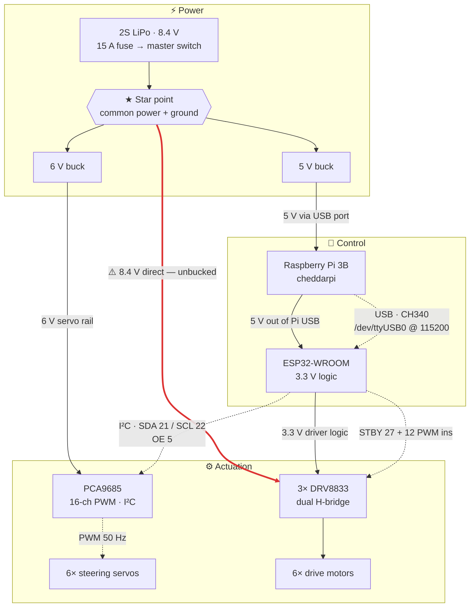
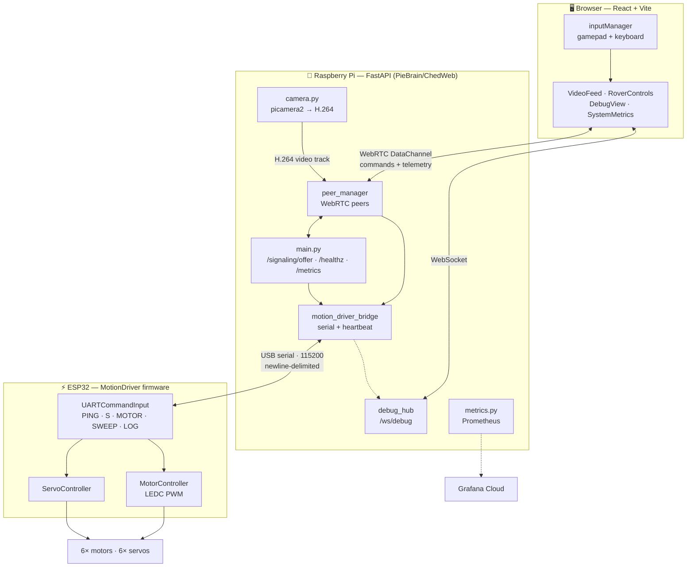

# Cheddar

Cheddar is a six-wheeled rocker-bogie rover that drives, steers, and climbs stairs — built on a
3D-printed chassis, driven by an ESP32, and flown from a browser over WebRTC with live video and a
gamepad.

Each of the six wheels has its own drive motor **and** its own steering servo, so the rover can
crab, spin in place, and pick its way up a staircase. A Raspberry Pi 3B does the thinking, video,
and web UI; an ESP32 does the real-time motor and servo work. It's a deliberate test bed — the
plan is to hang autonomous navigation, an arm, and (non-negotiably) a dog treat dispenser off it.

<!-- 📸 Photo goes here: drop an image at docs/cheddar.jpg and uncomment the line below. -->
<!--  -->

## The chassis

Printed from **[Stair Climbing Rover by WildWilly](https://www.printables.com/model/194299-stair-climbing-rover)**
on Printables — a rocker-bogie design originally built for the Danish DTU RoboCup, which is what
makes the stair climbing work. Also worth a look:
[six-wheeled RC rover mods](https://www.printables.com/model/677821-six-wheeled-rc-rover-mods)
(easier-to-print remixes) and a
[front canopy](https://www.printables.com/model/853506-stair-climbing-rover-front-canopy).

Everything above the chassis — electronics, firmware, and software — is ours.

## Circuit

Solid edges carry power, dashed edges carry signal. Simplified — see
**[HARDWARE.md](HARDWARE.md)** for the full pin map, bill of materials, and wiring truth.

The red edge is the one live problem: the motor rail is **unbucked**, so 6 V motors sit on the full
8.4 V pack. It also makes inrush worse, which can sag the shared rail far enough to
[brown out the Pi](HARDWARE.md#-known-issue--brownouts).

## Software architecture

The browser holds a WebRTC connection to the Pi carrying both H.264 video and a DataChannel for
control and telemetry. Commands land in `motion_driver_bridge`, which owns the serial link and
sends a **heartbeat** — if it stops, the firmware's deadman failsafe cuts the motors.

## Docs

**Start here:** [HARDWARE.md](HARDWARE.md) — bill of materials, wiring, pin map, power tree, and
every known hardware gotcha. Single source of truth for the physical build.

| Area | Doc |
| --- | --- |
| ESP32 firmware | [MotionDriver/README.md](MotionDriver/README.md) — components, UART protocol, flashing from the Pi |
| Pi setup | [PieBrain/README.md](PieBrain/README.md) · [SSH_ACCESS.md](PieBrain/SSH_ACCESS.md) |
| Web control app | [ChedWeb/README.md](PieBrain/ChedWeb/README.md) · [SETUP.md](PieBrain/ChedWeb/SETUP.md) · [DEPLOYMENT.md](PieBrain/ChedWeb/DEPLOYMENT.md) |
| Camera | [CAMERA_SETUP.md](PieBrain/ChedWeb/CAMERA_SETUP.md) |
| Driving it | [INPUT_SYSTEM.md](PieBrain/ChedWeb/INPUT_SYSTEM.md) — drive modes and input mapping |
| Monitoring | [METRICS.md](PieBrain/ChedWeb/METRICS.md) · [GRAFANA_SETUP.md](PieBrain/ChedWeb/GRAFANA_SETUP.md) · [TELEMETRY_IMPLEMENTATION.md](PieBrain/ChedWeb/TELEMETRY_IMPLEMENTATION.md) |
| Legacy debug bridge | [webapp/README.md](webapp/README.md) — bare FastAPI serial CLI |

`BlinkRGB/` and `ServoMotorDriver/` are historical Arduino sketches kept for reference only.

## Status

- ✅ Six-wheel drive and steer working; Pi ↔ ESP32 USB serial link solid
- ✅ ChedWeb WebRTC video + gamepad control operational, with a Debug tab for per-actuator poking
- ✅ Deadman failsafe and serial heartbeat in place
- ⚠️ Motor rail unbucked — 6 V motors on 8.4 V ([details](HARDWARE.md#-voltage-mismatch--6-v-motors-on-an-unbucked-84-v-rail))
- ⚠️ Motor inrush can brown out the Pi ([details](HARDWARE.md#-known-issue--brownouts))
- 🔜 Current sensing (INA226 on the existing I²C bus), then autonomy
